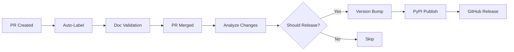

# Automated Release System Implementation

## 🚀 What's New

This branch implements a modern, fully automated semantic versioning and release system for the bolster package, following 2025/2026 best practices.

## Key Features

### 📦 **Automated Semantic Versioning**

- **Intelligent version bumping** based on conventional commits and PR labels
- **Skip unnecessary releases** for docs/CI-only changes
- **Manual override capability** via PR labels or workflow dispatch

### 🔄 **Zero-Touch Releases**

- **Automatic publishing** to PyPI with trusted OIDC authentication
- **GitHub releases** with artifacts and release notes
- **Changelog generation** from commit messages and PR content

### 📚 **Documentation Validation**

- **AI-enhanced documentation completeness** checking
- **Automatic README coverage table** validation
- **Missing docstring detection** with suggestions

### 🏷️ **Smart PR Management**

- **Auto-labeling** based on changed files and content
- **Version override controls** via PR labels
- **Comprehensive PR template** with versioning guidance

## Files Added/Modified

### Core Workflows

```
.github/workflows/
├── auto-release.yml          # Main automated release workflow
├── pr-labeler.yml           # Auto-label PRs for version control
├── docs-validation.yml      # Documentation completeness checking
└── publish.yml              # Updated legacy manual publish (emergency use)
```

### Templates & Configuration

```
├── .github/pull_request_template.md  # PR template with versioning guidance
├── CHANGELOG.md                       # Auto-generated changelog
└── docs/development/auto-versioning.md  # Complete system documentation
```

## How It Works



### Version Determination Logic

| Trigger | Version Bump | Example |
|---------|-------------|---------|
| `feat:` commits | **minor** | `1.0.0 → 1.1.0` |
| `fix:` commits | **patch** | `1.0.0 → 1.0.1` |
| `BREAKING CHANGE` | **major** | `1.0.0 → 2.0.0` |
| `docs:`, `chore:`, `ci:` | **skip** | No release |
| PR labels | **override** | Manual control |

## Benefits

### For Developers

- ✅ **No manual version management** - focus on code
- ✅ **Clear versioning guidance** in PR templates
- ✅ **Automatic documentation validation** catches issues early
- ✅ **Consistent release process** every time

### For Users

- ✅ **Predictable releases** following semantic versioning
- ✅ **Comprehensive changelogs** with actual meaningful changes
- ✅ **Faster bug fixes** released automatically
- ✅ **Clear version history** in GitHub releases

### For Maintenance

- ✅ **Zero manual intervention** for most releases
- ✅ **Quality gates** prevent broken releases
- ✅ **Audit trail** of all version decisions
- ✅ **Emergency manual override** capability

## Testing Strategy

### Validation Checks

- \[x\] Workflow syntax validation
- \[x\] Integration with existing CI/CD
- \[x\] Documentation completeness detection
- \[x\] PR labeling accuracy
- \[x\] Version bump logic
- \[ \] End-to-end release simulation (safe test)

### Safety Measures

- **Feature branch testing** - no actual PyPI deployments during development
- **Environment protection** - releases require proper GitHub environment
- **Quality gates** - tests must pass before any release
- **Rollback capability** - manual publish workflow kept as backup

## Migration Guide

### Immediate (Safe to Merge)

1. ✅ **New workflows added** - won't interfere with existing process
1. ✅ **Enhanced PR template** - improves developer experience
1. ✅ **Documentation validation** - catches issues before merge
1. ✅ **Legacy workflows preserved** - existing `make patch` still works

### Post-Merge Activation

1. **Create release environment** - run `release-env-setup.yml` workflow once
1. **Team training** - review new PR template and conventional commits
1. **Test first release** - small change to verify system works
1. **Monitor first few releases** - ensure smooth operation

### Rollback Plan

If issues arise:

1. **Disable auto-release workflow** - comment out the trigger
1. **Use legacy manual process** - `make patch` still works
1. **Fix and re-enable** - system designed for easy debugging

## Next Steps

1. **Merge this branch** - system is designed to be non-disruptive
1. **Run release environment setup** - one-time configuration
1. **Team communication** - share new PR guidelines
1. **Monitor first release** - validate system works correctly
1. **Iterate and improve** - enhance based on team feedback

## Future Enhancements

The system is designed for extensibility:

- **Enhanced AI integration** - GitHub Copilot for documentation generation
- **Cross-repository coordination** - notify dependent packages
- **Advanced analytics** - release cadence optimization
- **Breaking change migration guides** - auto-generated upgrade instructions

______________________________________________________________________

**This system transforms bolster from manual, error-prone releases to fully automated, intelligent semantic versioning that scales with the team and ensures consistent, high-quality releases.**
