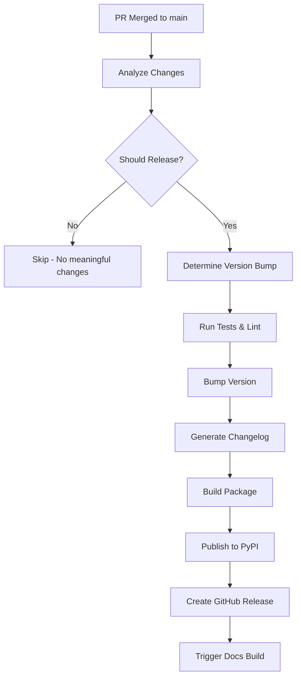

# Automated Versioning and Release System

This document describes the automated semantic versioning and release system implemented for the bolster package.

## Overview

The system automatically:

1. **Analyzes merged PRs** to determine appropriate version bump (major/minor/patch)
1. **Bumps version** using semantic versioning rules
1. **Generates changelog** from commit messages
1. **Publishes to PyPI** with trusted publishing
1. **Creates GitHub releases** with artifacts
1. **Validates documentation** completeness

## How It Works

### Trigger

- **Automatic**: Every push to `main` branch (i.e., merged PR)
- **Manual**: Workflow dispatch with version override

### Version Determination

The system uses multiple signals to determine version bump:

#### 1. Conventional Commits

- `feat:` → **minor** version bump
- `fix:` → **patch** version bump
- `BREAKING CHANGE` or `!:` → **major** version bump
- `docs:`, `chore:`, `ci:`, `style:`, `test:` → **skip release**

#### 2. PR Labels (Override)

- `version:major` → Force major bump
- `version:minor` → Force minor bump
- `version:patch` → Force patch bump
- `version:skip` → Skip release entirely

#### 3. Content Analysis

- Breaking changes detected in PR description
- New features vs bug fixes
- Documentation-only changes

### Workflow Steps



## Configuration Files

### Core Workflows

| File | Purpose |
|------|---------|
| `.github/workflows/auto-release.yml` | Main automated release workflow |
| `.github/workflows/pr-labeler.yml` | Auto-label PRs for version control |
| `.github/workflows/docs-validation.yml` | Documentation completeness checking |
| `.github/pull_request_template.md` | PR template with versioning guidance |

### Supporting Files

| File | Purpose |
|------|---------|
| `CHANGELOG.md` | Auto-generated changelog |
| `pyproject.toml` | Version configuration with bump-my-version |
| `.github/workflows/release-env-setup.yml` | One-time environment setup |

## Usage Guide

### For Developers

#### Creating a PR

1. Follow conventional commit format in PR title
1. Use the PR template to indicate change type
1. The system will auto-label your PR
1. Override version bump with labels if needed

#### Conventional Commit Examples

```bash
feat(nisra): add population statistics module     # → minor
fix(psni): correct date parsing in crime data     # → patch
feat!: restructure API with breaking changes      # → major
docs: update README with new examples            # → skip
```

#### PR Labels for Override

- Add `version:major` for breaking changes
- Add `version:minor` for new features
- Add `version:patch` for bug fixes
- Add `version:skip` for docs/maintenance only

### For Maintainers

#### Manual Release

```bash
# Trigger manual release via GitHub UI
# Go to Actions > Automated Release > Run workflow
# Choose version bump type: auto, patch, minor, major
```

#### Emergency Fixes

```bash
# If automated release fails, manual fallback:
git checkout main
git pull
uv run pytest tests/ -v
uv run pre-commit run --all-files
uv run bump-my-version bump patch
git push origin main --tags
```

## Quality Gates

### Pre-Release Checks

- ✅ All tests pass (`uv run pytest tests/ -v`)
- ✅ Linting passes (`uv run pre-commit run --all-files`)
- ✅ Documentation completeness validated
- ✅ Version bump is appropriate for changes

### Documentation Requirements

- Public functions must have docstrings
- New data source modules must be in README coverage table
- Breaking changes must be documented
- Examples must be provided for new features

## Security

### Trusted Publishing

- Uses OpenID Connect (OIDC) tokens for PyPI publishing
- No long-lived API keys stored in repository
- GitHub environment protection for releases

### Permissions

- `contents: write` - For version bumps and tags
- `pull-requests: read` - For analyzing PRs
- `id-token: write` - For trusted publishing

## Monitoring

### Success Indicators

- ✅ Version bumped in `pyproject.toml`
- ✅ Git tag created (`v1.2.3`)
- ✅ Package published to PyPI
- ✅ GitHub release created
- ✅ Documentation updated

### Failure Recovery

If the workflow fails:

1. Check GitHub Actions logs for specific error
1. Common issues:
   - Tests failing → Fix tests first
   - PyPI publishing → Check trusted publishing setup
   - Version conflicts → Manual version bump needed
1. Manual recovery steps provided above

## Best Practices

### Commit Messages

```bash
# Good
feat(nisra): add tourism occupancy statistics
fix(dva): handle missing vehicle registration data
docs: update API examples for new tourism module

# Avoid
update stuff
fix bug
improvements
```

### PR Descriptions

- Clearly describe what changed
- Mention breaking changes explicitly
- Include usage examples for new features
- Reference related issues/PRs

### Version Strategy

- **Patch** (1.0.0 → 1.0.1): Bug fixes, data corrections
- **Minor** (1.0.0 → 1.1.0): New data sources, new features
- **Major** (1.0.0 → 2.0.0): Breaking API changes

## Troubleshooting

### Common Issues

| Problem | Solution |
|---------|----------|
| Release skipped unexpectedly | Check if PR only contains docs/CI changes |
| Wrong version bump | Add appropriate PR label to override |
| Tests fail during release | Fix tests, version bump will retry |
| PyPI publishing fails | Check trusted publishing configuration |
| Documentation validation fails | Add missing docstrings to public functions |

### Debug Commands

```bash
# Check current version
uv run python -c "import importlib.metadata; print(importlib.metadata.version('bolster'))"

# Test version bump locally (dry run)
uv run bump-my-version bump --dry-run patch

# Check what would be released
git log $(git describe --tags --abbrev=0)..HEAD --pretty=format:"%s"
```

## Future Enhancements

Potential improvements to consider:

1. **Enhanced AI Integration**

   - GitHub Copilot for automatic documentation generation
   - Intelligent changelog enhancement
   - Breaking change detection

1. **Release Notes Intelligence**

   - Auto-generate release notes from PR content
   - Highlight important changes for users
   - Include migration guides for breaking changes

1. **Cross-Repository Integration**

   - Notify dependent packages of new releases
   - Coordinate releases across multiple packages
   - Version compatibility checking

1. **Advanced Analytics**

   - Release cadence optimization
   - Change impact analysis
   - User adoption tracking
